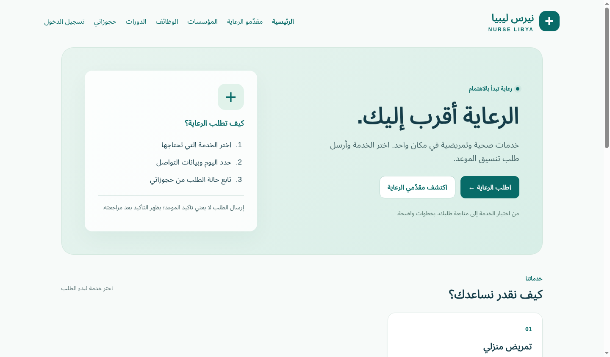

# نيرس ليبيا

واجهة عربية RTL ثابتة للحسابات وطلب الرعاية والأدلة المهنية والفرص. هذه نسخة مستودع GitHub المطابقة لمشروع Supabase `juxiaorwaiazfjlmkcvm`؛ تختلف عن مصدر Lovable السابق.

## الوظائف

- خدمات نشطة من قاعدة البيانات، مع اختيار الخدمة ومقدّمها قبل الدخول واستئناف الطلب بعد المصادقة.
- التسجيل والدخول واستعادة الحساب وتعديل الاسم والهاتف. نوع المهنة المطلوب لا يمنح دورًا أو صلاحية.
- حجوزات خاصة بالمستخدم، تحقق من التاريخ والهاتف والاسم، ومرجع UUID ثابت لاستعادة محاولة غامضة دون إنشاء طلب آخر. بدء طلب مختلف قرار واضح؛ إعادة تحميل الصفحة تفقد مرجع المحاولة غير المحفوظ محليًا، لذا راجع حجوزاتك قبل إعادة الإرسال.
- أدلة الأطباء والتمريض والمؤسسات مع بحث وفلاتر المدن؛ إسقاطات عامة محدودة دون بيانات المرضى أو هواتف الحسابات الخاصة.
- وظائف نشطة غير منتهية، تقديم وسحب ومتابعة الطلبات الخاصة.
- دورات منشورة بعد الموافقة، وطلبات التحاق مجانية قيد المراجعة. لا تحصيل دفع أو تأكيد قبول تلقائي.
- طلبات اعتماد المهنة، وإدارة المؤسسات الخاصة بالحساب، ونشر وظائف ودورات للحسابات ذات الدور المخوّل في قاعدة البيانات.
- إنشاء وتعديل ملف مقدّم الخدمة في الدليل، ومراجعة الإدارة للطلبات والمؤسسات والدورات والملفات والحجوزات.
- فصل الحسابات، ومنع الردود المتأخرة والإرسال المتزامن، وعرض محتوى المستخدم كنص.

## التشغيل

لا تحتاج ملفات الإنتاج بناءً أو Node:

```sh
python3 -m http.server 8080
```

افتح `http://localhost:8080`. انشر `index.html` و`styles.css` و`config.js` وملفات JavaScript الموجودة في الجذر معًا. تعتمد المصادقة على Supabase SDK المثبت عند الإصدار `2.57.4`؛ خط Tajawal له بديل محلي عند تعذر تحميله. حافظ على المسار الأساسي إذا استُخدم GitHub Pages.

`config.js` يحتوي إعداد Supabase العام الموجود أصلًا في المستودع. لا تضع مفاتيح secret أو service_role في المتصفح، ولا تحتاج هذه الصفحة ملفات `.env`.

## قاعدة البيانات وحالة التفعيل

اقرأ [العقد الحالي](docs/current-database-contract.md) و[إصلاحات قاعدة البيانات المقترحة](docs/proposed-database-fixes.sql) قبل النشر. ملف SQL مقترح للمشروع المطابق، **لم يُطبّق**؛ يتضمن حماية توثيق الملفات ونشر الدورات، وإصلاح اعتماد الحساب، ومراجعة الحجز والطلب المرتبط ذريًا.

يحمي RPC القراءة `nurse_app_contract_version()` تفعيل حفظ ملفات الدليل وقرارات الإدارة الحساسة. غيابه يُظهر أن الإصلاحات مطلوبة ويمنع هذه العمليات. لا تُفعّلها بتغيير JavaScript أو بقيمة إعداد محلية. العمليات القائمة، مثل حفظ بيانات الحساب والحجز وطلب الاعتماد، تستعمل العقد الحالي.

بعد تطبيق المراجعة المطلوبة، تحقّق من سياسات RLS والوظائف داخل بيئة اختبار مصرح بها، ومن Auth Site URL وRedirect URLs وSMTP على عنوان النشر النهائي. لا تمثل اختبارات المحاكاة اختبارًا لتسليم البريد أو لإصلاح قاعدة البيانات الحية. `docs/database-fixes.sql` سجل الإصلاحات السابقة في 5 أكتوبر، ولا يُعاد تشغيله تلقائيًا.

تحتاج علامات التوثيق التاريخية إلى مراجعة بشرية: كانت قابلة للتعديل من أصحاب الملفات قبل الإصلاح. صلاحيات تعديل `service_requests` المباشر القديمة تحتاج حراسة مستقلة قبل تقديم واجهة تحريرها؛ هذه النسخة تستخدم RPC مراجعة الحجز المحدود ولا توفر محررًا عامًا لها. لا ينشئ التعديل مشرفًا ولا يغيّر دور مستخدم بعينه.

## صور الواجهة

هذه صور فحص المتصفح ببيانات خدمات محاكاة، وليست سجلات حية.



[واجهة الهاتف](docs/preview-mobile.png)

## الاختبارات

التطوير والاختبارات على Node 24 أو أحدث:

```sh
npm ci --ignore-scripts
npm run check
npm test
npm run test:browser
```

اختبارات DOM تستخدم Supabase محاكى. فحص المتصفح يحتاج Chromium أو `CHROMIUM_BIN`، ويحجب الاتصالات الخارجية ويستبدل SDK والإعدادات قبل تحميل الصفحة. لا ينشئ حسابات أو حجوزات حقيقية ولا يرسل بريدًا. التفاصيل والنتائج في [تقرير التحقق](docs/validation-oct7.md).

المتجر والرسائل والدفع والمحتوى التدريبي التفصيلي ليست وظائف منفذة هنا؛ لا يوجد عقد متجر أو دفع مثبت لهذه القاعدة. هذه الدفعة لا تغيّر الموقع المنشور على Lovable أو إعدادات Auth تلقائيًا.
